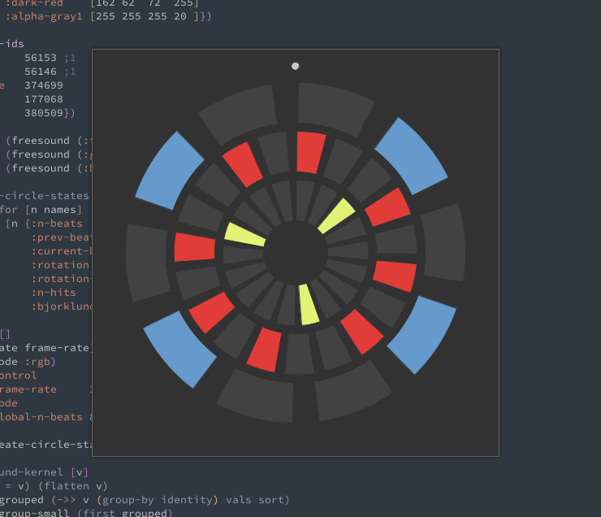

# Euclidean Tala 

A demo of using the  [Euclidean Algorithm](http://cgm.cs.mcgill.ca/~godfried/publications/banff.pdf) to generate music, with an added polyrhythmic setting which, for me, sounds more like [tala](https://en.wikipedia.org/wiki/Tala).

